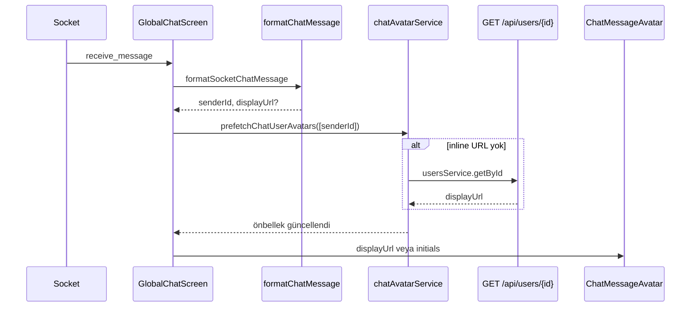

# Global Chat — profil fotoğrafları (avatar)

Bu belge, **Global Community Chat** ekranında mesaj atan kullanıcıların profil fotoğraflarının nasıl gösterildiğini açıklar.

**Ana ekran:** `src/screens/GlobalChatScreen.tsx`  
**İlgili özellik:** Profil fotoğrafı yükleme → bkz. [profile-photo-upload.md](./profile-photo-upload.md)

---

## Kullanıcı deneyimi

- Her mesaj satırında (kendi mesajın dahil) sol/sağ tarafta **32×32 avatar** görünür.
- Kullanıcının `displayUrl` profil fotoğrafı varsa → `<Image />` ile gösterilir.
- Yoksa → kullanıcı adının ilk iki harfi (initials), önceki davranış gibi.

**Test yolu:** Chats → Global Community Chat

---

## Sorun: socket mesajında fotoğraf yok

Swagger `Message` şeması yalnızca şunları içerir:

- `senderId`, `senderName`, `message`, `roomId`, …

**`displayUrl` veya avatar alanı yok.** Bu yüzden istemci, her benzersiz `senderId` için kullanıcı profilini ayrıca çeker.

---

## Uçtan uca akış

```text
Socket: previous_messages / receive_message
  → formatSocketChatMessage (senderId, senderName, opsiyonel inline displayUrl)
  → prefetchForMessages → chatAvatarService
       1. Bellek önbelleği (Map)
       2. profilePhotoCache (AsyncStorage, aynı cihazda yüklenmiş fotoğraflar)
       3. GET /api/users/{senderId} → User.displayUrl
  → ChatMessageAvatar bileşeni UI'da render
```



---

## Dosya yapısı

| Dosya | Rol |
|--------|-----|
| `src/screens/GlobalChatScreen.tsx` | Mesaj listesi, avatar prefetch, `ChatMessageAvatar` kullanımı |
| `src/components/ChatMessageAvatar.tsx` | Fotoğraf veya initials; yeniden kullanılabilir bileşen |
| `src/utils/formatChatMessage.ts` | Ham socket/API mesajını `FormattedChatMessage`'a çevirir |
| `src/services/chatAvatarService.ts` | Bellek + API ile avatar URL çözümleme |
| `src/hooks/useChatUserAvatars.ts` | React hook: prefetch + `getAvatarUrl` |
| `src/services/usersService.ts` | `GET /api/users/{id}` → `displayUrl` |
| `src/services/profilePhotoCache.ts` | Cihazda `profile_photo_url:{userId}` önbelleği |
| `src/services/chatService.ts` | `Message` tipine opsiyonel `senderDisplayUrl` eklendi |

---

## Önbellek katmanları

| Katman | Anahtar / konum | Ne zaman dolar |
|--------|------------------|----------------|
| **Bellek** | `chatAvatarService` içi `Map<userId, url>` | Oturum boyunca; uygulama kapanınca silinir |
| **Cihaz** | `profile_photo_url:{userId}` | Profil fotoğrafı yükleyen veya daha önce chat'te görülen kullanıcılar |
| **Sunucu** | User kaydı `displayUrl` | `GET /api/users/{id}` |

Aynı kullanıcı için tekrar API çağrısı yapılmaz (`memory.has` kontrolü).

---

## Inline URL (backend hazır olunca)

Socket veya REST mesajında aşağıdaki alanlardan biri gelirse **API çağrısı atlanır**:

- `senderDisplayUrl`
- `senderAvatar` / `senderPhoto`
- `sender.displayUrl` / `sender.profilePicture` / …

`formatChatMessage.ts` içindeki `readSenderPhoto()` bu alanları okur.

**Backend önerisi** — her mesajda:

```json
{
  "senderId": "507f1f77bcf86cd799439013",
  "senderName": "Omer",
  "senderDisplayUrl": "https://cdn.example.com/avatars/omer.jpg",
  "message": "Hello!"
}
```

---

## UI detayları

- **Kendi mesajların:** `currentUser.displayUrl` (`authService.getStoredUser()`).
- **Diğer kullanıcılar:** `getAvatarUrl(senderId, msg.displayUrl)`.
- Her iki tarafta da avatar gösterilir (`msgRow` / `msgRowMe` + `row-reverse`).
- Fotoğraf yoksa initials; kırık URL durumunda React Native `Image` boş kalabilir — ileride `onError` ile initials’e düşürülebilir.

---

## API bağımlılıkları

| Endpoint | Kullanım |
|----------|----------|
| Socket `join_room` / `previous_messages` / `receive_message` | Mesaj akışı |
| `GET /api/users/{id}` | Gönderen profil fotoğrafı (Bearer token) |

Profil fotoğrafının API’de görünmesi için kullanıcının [profil yükleme](./profile-photo-upload.md) akışından geçmiş olması veya backend’in `displayUrl` persist etmesi gerekir.

---

## Gelecek iyileştirmeler

1. **Backend:** Mesajla birlikte `senderDisplayUrl` gönder (N+1 API çağrısını kaldırır).
2. **DM / event chat:** Aynı `ChatMessageAvatar` + `useChatUserAvatars` → `ChatDetailScreen` vb.
3. **Avatar tıklama:** `navigation.navigate('UserProfile', { userId })`.
4. **Toplu prefetch:** `GET /api/users` ile sınırlı batch (dikkatli; performans).

---

## Test checklist

- [ ] Giriş yap, profil fotoğrafı yükle, global chat’te kendi mesajında fotoğraf görünür
- [ ] Başka kullanıcı (profil fotoğrafı olan) mesaj atınca avatar görünür
- [ ] Fotoğrafı olmayan kullanıcı → initials
- [ ] Odaya girince geçmiş mesajlarda avatarlar yüklenir (`previous_messages`)
- [ ] Yeni mesaj gelince avatar prefetch çalışır (`receive_message`)

---

## Çalıştırma

```cmd
cd c:\Users\omery\advanced-messaging-app\Advanced-Messaging-App
npm start
```

`.env`:

```env
EXPO_PUBLIC_API_URL=https://test.sarajevoexpats.com
EXPO_PUBLIC_USE_MOCK=false
```
