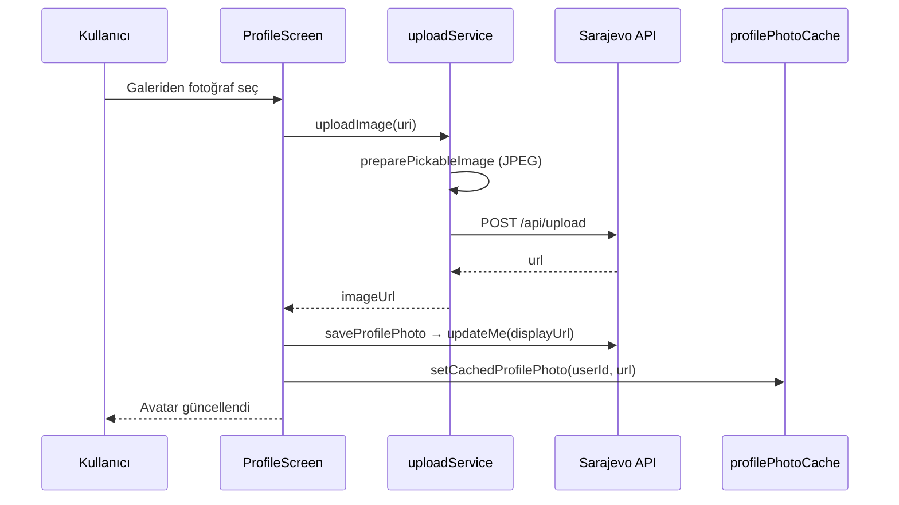

# Profil fotoğrafı yükleme

Bu belge, Sarajevo Expats mobil uygulamasında **profil avatarı** (galeriden seçim + sunucuya yükleme) özelliğinin nasıl çalıştığını açıklar.

**Branch:** `feat/profile-photo`  
**Ana ekran:** `src/screens/ProfileScreen.tsx`

---

## Kullanıcı akışı

1. Kullanıcı **Profil** sekmesine girer.
2. Büyük avatara dokunur veya **Edit profile** → **Choose from gallery**.
3. Galeriden fotoğraf seçilir.
4. Uygulama fotoğrafı sunucuya yükler, dönen URL profil kaydına yazılır.
5. Avatar güncellenir; aynı cihazda çıkış/giriş sonrası fotoğraf **yerel önbellek** sayesinde görünmeye devam edebilir.

Fotoğraf yoksa avatar, kullanıcı adının ilk iki harfi (initials) ile gösterilir.

---

## Uçtan uca akış (teknik)

```text
Galeri (expo-image-picker)
  → JPEG’e dönüştür (expo-image-manipulator)
  → POST /api/upload  (multipart, alan: file)
  → Sunucu { url: "https://..." } döner
  → PATCH /api/users/me { displayUrl: url }  (veya PUT /api/users/{id})
  → AsyncStorage: auth_user + profile_photo_url:{userId}
  → UI: user.displayUrl ile <Image />
```



---

## Dosya yapısı

| Dosya | Rol |
|--------|-----|
| `src/screens/ProfileScreen.tsx` | UI, galeri seçimi, yükleme durumu, avatar gösterimi |
| `src/screens/UserProfileScreen.tsx` | Başka kullanıcının `displayUrl` avatarını gösterir |
| `src/services/uploadService.ts` | `POST /api/upload`, JPEG hazırlama, URL parse |
| `src/services/authService.ts` | `saveProfilePhoto`, `updateMe`, `getMe` normalizasyonu |
| `src/services/profilePhotoCache.ts` | Kullanıcı başına fotoğraf URL önbelleği (logout sonrası) |
| `src/services/usersService.ts` | `GET /api/users/{id}` için `displayUrl` map |
| `src/types/user.types.ts` | `User.displayUrl?: string` |
| `src/services/api.ts` | FormData isteklerinde `Content-Type` düzeltmesi |

---

## API uç noktaları

Swagger: [test.sarajevoexpats.com/api/api-docs](https://test.sarajevoexpats.com/api/api-docs/)

| Adım | Method | Endpoint | Not |
|------|--------|----------|-----|
| Yükleme | `POST` | `/api/upload` | `multipart/form-data`, alan adı: **`file`**. Bearer token gerekir. |
| Profil okuma | `GET` | `/api/users/me` | `displayUrl` (veya eşdeğer alan) dönerse kalıcı profil fotoğrafı |
| Profil güncelleme | `PATCH` | `/api/users/me` | Swagger’da dokümante olmayabilir; uygulama `displayUrl` gönderir |
| Yedek güncelleme | `PUT` | `/api/users/{id}` | PATCH başarısız olursa denenir |

Upload cevabı örneği:

```json
{
  "url": "https://example.com/uploads/photo.jpg",
  "message": "File uploaded successfully"
}
```

Profil kaydında gönderilen alanlar (backend hangisini kabul ederse):

- `displayUrl`, `profilePicture`, `avatar`, `picture`
- snake_case: `display_url`, `profile_picture`

---

## uploadService detayları

- **`preparePickableImage`:** iOS HEIC ve Android `content://` URI’lerini JPEG’e çevirir (`expo-image-manipulator`, max genişlik 1200px).
- **`uploadImage`:** `fetch` ile `POST /api/upload`; axios varsayılan `application/json` başlığı kullanılmaz.
- **`extractUrl`:** `{ url }`, `{ data: { url } }`, dizi vb. cevap şekillerini normalize eder.

İlan/mekan fotoğrafları (`SubmitRealEstateScreen`, `SubmitPlaceScreen`) aynı `uploadService`’i kullanır.

---

## Yerel önbellek (logout sonrası)

Sunucu `GET /api/users/me` içinde `displayUrl` döndürmese bile, aynı cihazda fotoğraf kaybolmasın diye:

- Anahtar: `profile_photo_url:{userId}` (`AsyncStorage`)
- **Logout** sırasında silinmez (sadece `auth_token` ve `auth_user` silinir).
- **Login** / `getStoredUser` / `getMe` sonrası `enrichUserWithProfilePhoto` sunucu URL’si yoksa önbelleği birleştirir.

Kalıcılık **tüm cihazlarda** için backend’in kullanıcı kaydına URL yazması gerekir.

---

## Ortam değişkenleri

`.env` (commit edilmez):

```env
EXPO_PUBLIC_API_URL=https://test.sarajevoexpats.com
EXPO_PUBLIC_USE_MOCK=false
```

---

## Bağımlılıklar

| Paket | Kullanım |
|--------|----------|
| `expo-image-picker` | Galeri izni ve seçim |
| `expo-image-manipulator` | JPEG dönüşümü / sıkıştırma |
| `@react-native-async-storage/async-storage` | Oturum + fotoğraf önbelleği |

---

## Test checklist

- [ ] Giriş yapılmış hesapla profil fotoğrafı seç
- [ ] Upload başarılı → avatar görünür
- [ ] Logout → Login → aynı cihazda avatar hâlâ görünür
- [ ] Başka cihaz / temiz kurulum → sunucu `displayUrl` persist ediyorsa görünür
- [ ] Upload 403 → hesapta `upload.single` yetkisi gerekebilir (backend)

---

## Bilinen sınırlamalar

1. **Backend:** Swagger `User` şemasında profil fotoğrafı alanı sınırlı dokümante; tam cross-device senkron backend ekibinin `displayUrl` desteğine bağlı.
2. **Sadece galeri:** Kamera ile çekim ayrıca eklenebilir (`ImagePicker.launchCameraAsync`).
3. **Google/Gmail profil fotoğrafı:** Bu branch’te yok; yalnızca cihaz galerisi.

---

## İlgili commit

```text
feat: profile photo upload from gallery
```

Branch: `feat/profile-photo`
